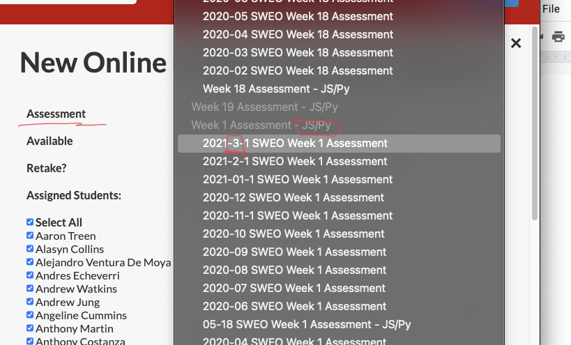
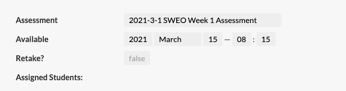
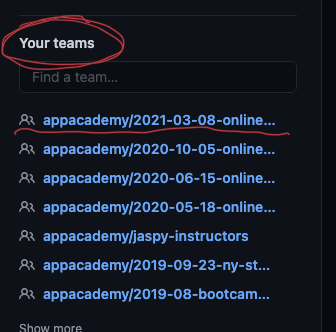
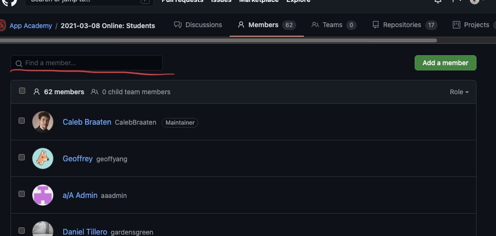
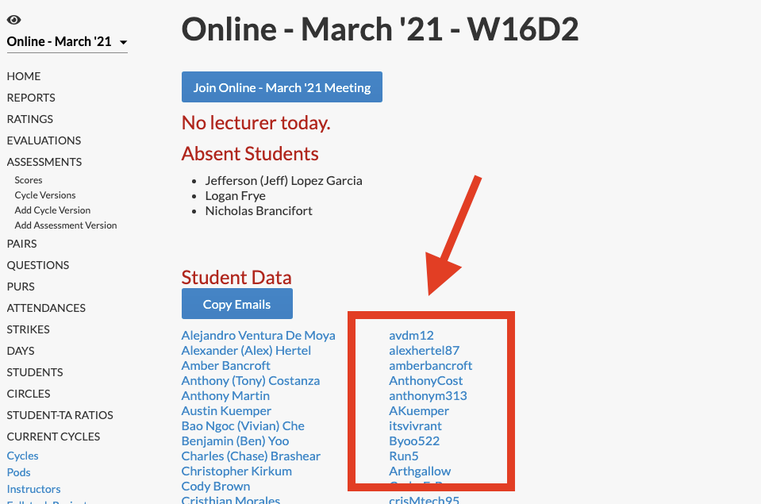
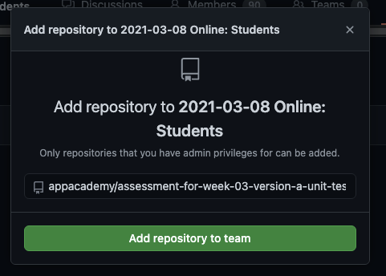
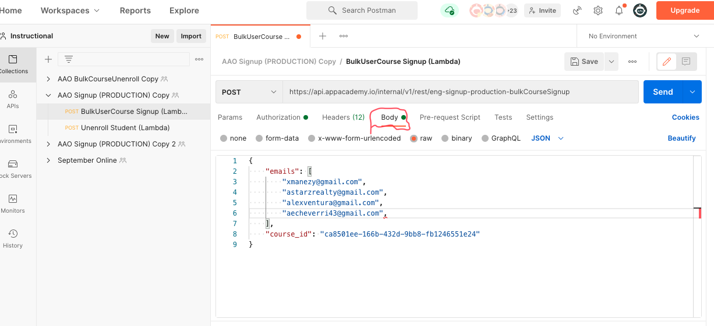
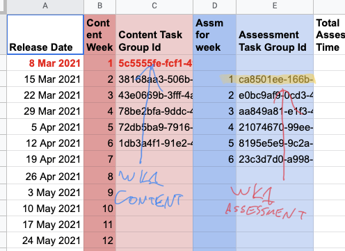
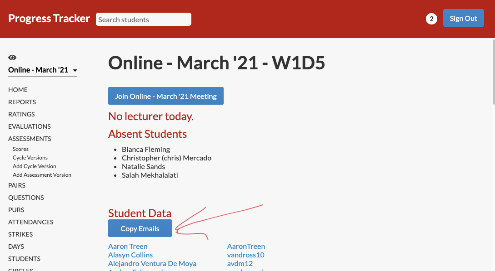

# Setting Up for a SWEO Assessment

1. Add Cycle Version _(this step can be done the week before once assessment versions have been generated by the curriculum team)

    a. Select the correct assessment version (check the month, check the curriculum… it’s a very long list to cycle through)   

    

    b. Choose when it should be available (the time is set to Pacific time)   

    
    
2. Double check that all of your cohort is in your GitHub team! If they are not, they will not have access to the repos for their assessment. _(This is especially important in the first few weeks of a new cohort, when logistics are tricky and students may not have seen their invitation to join the github team)

    a. Teams can be found in the side-bar of the main github page 

    

    b. Search through the team members on the github team page, using the list of github handles on the home page of Progress Tracker to ensure everyone is a member. 

    

    

    c. If anyone is missing, add them or reach out to Maggie Shaughnessy (Director of Instruction, Online) if you lack the group permission to do this.

    d. If anyone has not accepted their invitation to the team, spam them on slack or beam them to the “principal’s office” breakout room in zoom until they join.

3. Add assessment repo into the cohort’s GitHub team _(This and all following steps should be done until just prior to the assessment start time)_
    a. Navigate to the repositories of the cohort team.
    
    b. Click 

    

    c. Search for the starter repo for the assessment by name, and click “Add repository to team” 

    

4. Give them access to the assessment on a/A Open

    a. Use the bulk course signup form in postman ([postman setup instructions](https://appacademyio.atlassian.net/wiki/spaces/IN/pages/1784938501/Add+Course+Content+in+AAO)) 

    

    b. Head to the [Course Catalog](https://docs.google.com/spreadsheets/d/1wbQXuBVrOibPaBVt9mGuNOwhHN0PzN25n83b0hSk_To/edit#gid=1055392971) and grab the course_id for the appropriate assessment, paste it into the body of your request

    

    c. Copy the array of emails from PT’s cohort home page and paste it into the body of your request

     

    d. Correct any emails that don’t align with your student’s github accounts...
    e. Post it

5. Students should now have access to the assessment in a/A Open!