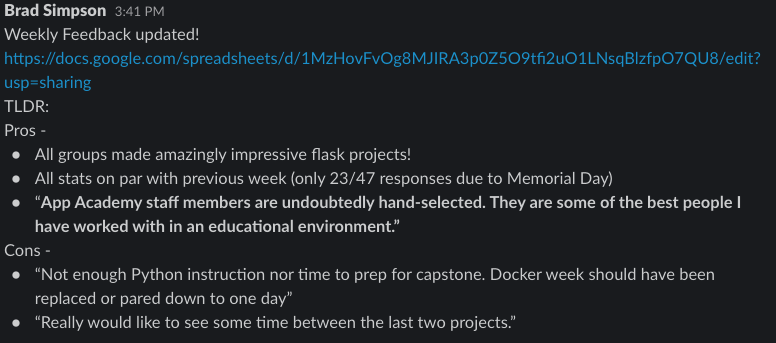

# Weekly Feedback Reports

1. Pull the results from the Weekly Feedback Survey
    a. Students receive this survey with their Monday night Progress Tracker Reports
    b. Data is ready by the start of class Tuesday morning, and it is due to be reported on during lunchtime Wednesday at the Instructional Online meeting (so plan accordingly for when you want to complete this task)
    c. Go to the Cycles tab on Progress Tracker
    d. Click on the Weekly Feedback button for the cohort you are reporting on
    e. A CSV file with all cumulative data on that cohort will be downloaded local to you computer
2. Open up a blank Google Sheets file to import the new data into.
    a. In the file menu chose to import, and then under import you want to upload a file
    b. Import the data (the CSV file you downloaded about) with the default settings
    c. Copy the cells for the current weeks data you are reporting on (the report is cumulative for the duration of the cohort)
3. Open up the Cohort’s Weekly Feedback Tracking Report
    a. If this is a new cohort, you can get a blank tracking sheet here: [https://docs.google.com/spreadsheets/d/1VbOdm6hEYEOr174aRuzPnPbWZvVknYmFgfjMIbT13JA/edit?usp=sharing](https://docs.google.com/spreadsheets/d/1VbOdm6hEYEOr174aRuzPnPbWZvVknYmFgfjMIbT13JA/edit?usp=sharing)
    b. Paste the copied cells into the first available row on the main page of Weekly Feedback report.  _Right click and use “Paste Special” and chose values only, as the sheet should take care of all the formatting for you_
    c. Click on the filter icon in cell C3 “week” and filter the results for the current week you are reporting on
    d. The tabs for ‘lessons’, “engagement”, “stress”, and “TA” will all be automatically populated with the new data for that week.  Compare the new stats to the previous weeks so you can report on the change in the Instructional Online Meeting
    e. Make a new copy of the comments tab for the new week, rename it and clear out all previous data.
    f. Copy all the data from the ‘feedback” and “additional comments” columns on the main sheet into the new comments tab you just made.  _It may be helpful to paste this data on the side, using “paste special formats” like above, and then sort them into the different categories of positive /  neutral /  negative._
4. Summarize the Weekly Feedback, touching on the change in the scores, any outstanding wins / challenges and any other notable points to share with the rest of the cohort’s Instructional team.  _A post in the cohorts instructors channel is a good space for this summary_
    a. Sample slack post to follow:
    b. 
    

5. Meet with the cohort’s instruction team to review / discuss
    a. Typically done in a thread on the slack post summary or during a 15 minute meeting right before presenting the material at the Instructional Online meeting
    b. Make sure to discuss wins, staff shout out, and most specifically challenges and how to deal with those so the entire cohort’s instructional team is on the same page
6. Present the summary at the Instructional Online meeting during lunch on Wednesday
    a. Talk about the numbers
        1. Number of deferrals on Monday’s assessment
        2. Change in metrics from previous week and anything that might have contributed to those changes (project week, short week, particularly tough assessment, curriculum changes)
    b. Report on the feedback comments
        3. Share wins and losses
        4. If student feedback says something better than you can, quote it!
        5. Focus on wins and challenges
        6. Give shout outs to TA’s and Module Staff when applicable
    c. Mention how the current week seems to be progressing
    d. Try to keep it short and sweet

	
